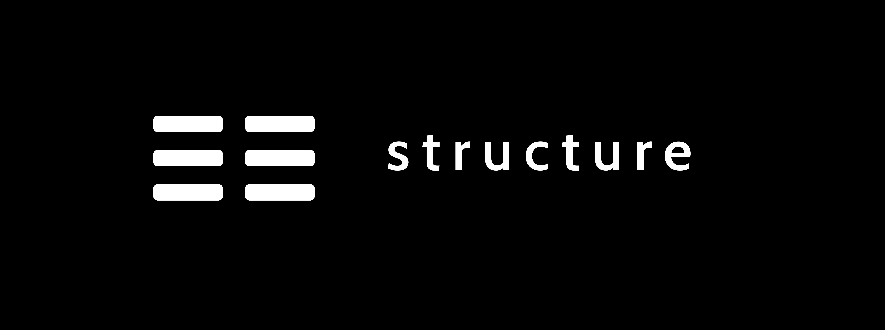

<div align="center">
  <br>
  
  
  <strong>Easily structure data with LLM.</strong>
</div>
<br>
<p align="center">
  <a href="https://github.com/matthieu-perso/structure/releases">
    
  </a>
  <a href="https://discord.gg/ZKE4X3qk">
    
  </a>
</p>

# Overview

Structure is a powerful tool that allows you to easily structure unstructured data using LLM. It can be used both as a server with API endpoints and as a standalone package integrated into your own script.

Structure can be used both as a server and as a standalone package.

- As a server: use Api endpoints to upload both your schema and your data.
- As a package: easily integrate Structure's methods into your own script.

# Get started

For both server and package mode, the general approach is identical.

Steps :

1. Before starting, set the OPENAI_API_KEY variable.
2. Create a schema
3. Load your unstructured data and receive it in a structured format.

## Package mode

WIP

## Server mode

### Start the server

```shell
structure server --host 0.0.0.0 --port 8080 --log-level info
```

### API calls

```shell
curl -X POST -H "Content-Type: multipart/form-data" -F "file=@file.pdf" http://localhost:8000/parsing
```

## Docker

Build the Docker image

```shell
docker build -t structure-llm .
```

Run the Docker image.

```shell
docker run -p 4000:80 structure-llm
```


# Contributing

We warmly welcome contributions to our open-source project !

You can contribute in various ways such as adding a new feature, enhancing functionalities, or improving documentation.

Please refer to CONTRIBUTING.md for guidelines on how to make contributions.

If you have any enquiries, please write use on our Discord.
